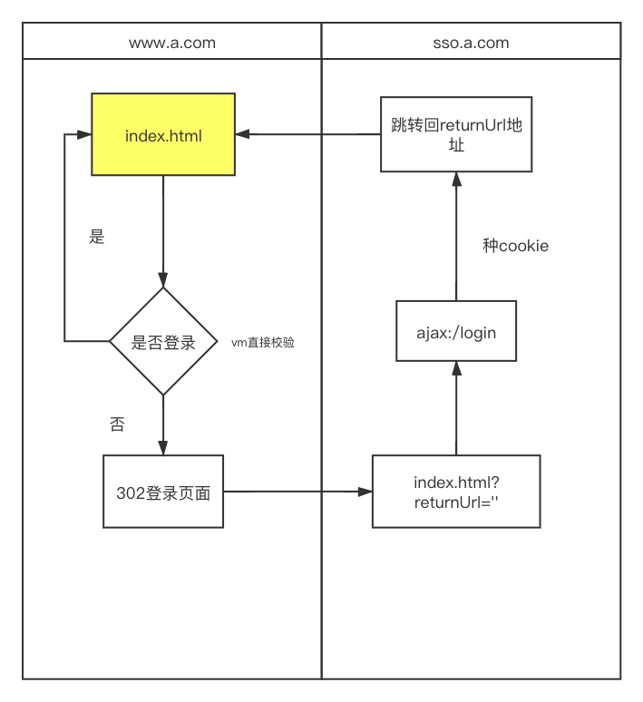
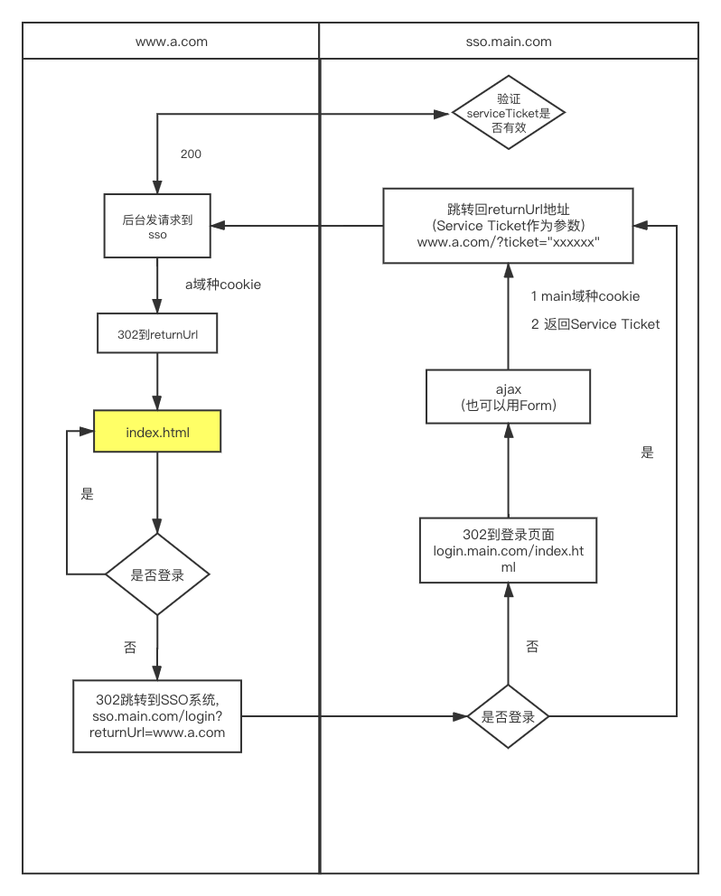
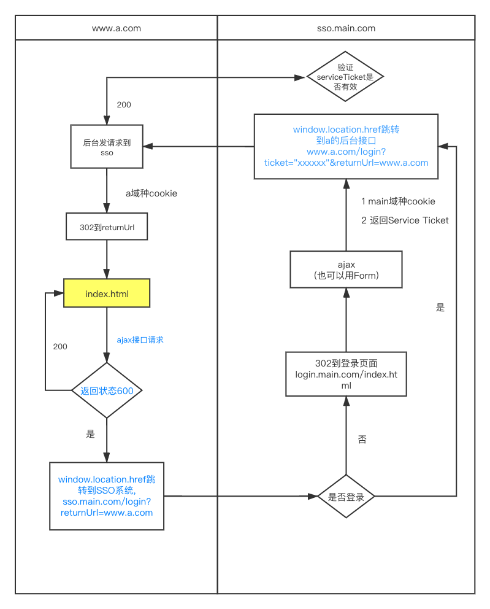

#### 什么是SSO

单点登录英文全称Single Sign On，简称就是SSO。
它的解释是：**在多个应用系统中，只需要登录一次，就可以访问其他相互信任的应用系统。**

#### 背景
互联网初期，企业使用的系统很少，通常一个或者两个，每个系统都有自己的登录模块，运营人员每天用自己的账号登录，很方便。
但随着企业的发展，用到的系统随之增多，运营人员在操作不同的系统时，需要多次登录，而且每个系统的账号都不一样，这对于运营人员来说，很不方便。其实不只是运营的不方便,对于普通的用户而言,在使用同一企业的不同系统时,也会存在各种问题。

于是，就想到是不是可以在一个系统登录，其他系统就不用登录了呢？这就是单点登录要解决的问题。

#### 前端技术实现

##### 我们先回顾下普通的登录认证机制。

1. 我们在浏览器（Browser）中访问一个应用，这个应用需要登录，我们填写完用户名和密码后，完成登录认证。
2. 这时，我们在这个用户的session中标记登录状态为yes（已登录），同时在浏览器（Browser）中写入Cookie，这个Cookie是这个用户的唯一标识。
3. 下次我们再访问这个应用的时候，请求中会带上这个Cookie，服务端会根据这个Cookie找到对应的session，通过session来判断这个用户是否登录。

##### 同域下的单点登录

一个企业只有一个域名，通过二级域名区分不同的系统。  
比如我们的域名是`a.jclps.com`,另外我们还有几个系统:
+ `b.jclps.com`
+ `c.jclps.com`
这时,我们要做单点登录（SSO），需要一个登录系统，叫做`sso.jclps.com`。可以将Cookie的域设置为顶域，即`jclps.com`,**我们在设置Cookie时，只能设置顶域和自己的域，不能设置其他的域。** 这样Cookie的问题解决了。

但这不算是真正的单点登录。同域下的单点登录是巧用了Cookie顶域的特性。如果是不同域呢？不同域之间Cookie是不共享的，怎么办？

##### 不同域下的单点登录

CAS官网上的标准流程，具体流程如下：

1. 用户访问`a.jclps.com`系统，`a.jclps.com`系统是需要登录的，但用户现在没有登录。
2. 跳转到CAS server，即SSO登录系统，弹出用户登录页。
3. 用户填写用户名、密码，SSO系统进行认证后，将登录状态写入SSO的session，浏览器（Browser）中写入SSO域下的Cookie。
4. SSO系统登录完成后会生成一个Service Ticket，然后跳转到`a.jclps.com`系统，同时将Service Ticket作为参数传递给`a.jclps.com`系统。
5. `a.jclps.com`系统拿到Service Ticket后，从后台向SSO发送请求，验证Service Ticket是否有效。
6. 验证通过后，`a.jclps.com`系统将登录状态写入session并设置`a.jclps.com`域下的Cookie。

以上是标准的sso的流程, 然而到具体的项目, 可能会有一些不同, 但总体的流程不变.

##### 前后端分离的单点登录

现在很多管理系统都是前后端分离的, 需要有哪些注意的点呢, 如下图

基本逻辑不变,主要就是后台302的地方改为前端跳转, 跳转页面改为跳转到对应系统的后台接口

##### 主站的垂直域的SSO

##### 需要注意的点

SSO这一理念到目前为止已经非常成熟，关于它的各种设计、设置都可以定制一套标准了。
1. SSO只需负责登录这单一功能即可,不要与业务耦合

##### 服务端的单点登录
其实在单点登录上,服务端要做的事情要比前端多的多,感兴趣的可以自己在网上查查CAS的标准流程

> CAS是Central Authentication Service的缩写，中央认证服务，一种独立开放指令协议。

1. 开源的企业级单点登录解决方案。
2. CAS Server 为需要独立部署的 Web 应用。
3. CAS Client 支持非常多的客户端(这里指单点登录系统中的各个 Web 应用)，包括 Java, .Net, PHP, Perl, Apache, uPortal, Ruby 等。
4. CAS属于Apache 2.0许可证，允许代码修改，再发布（作为开源或商业软件）。

##### 最后

虽然SSO很多工作是由服务端来做, 但是了解标准的流程也是很重要的,可以使我们在配合服务端开发的时候,清楚哪些能做,哪些应该做,避免将来的返工。

